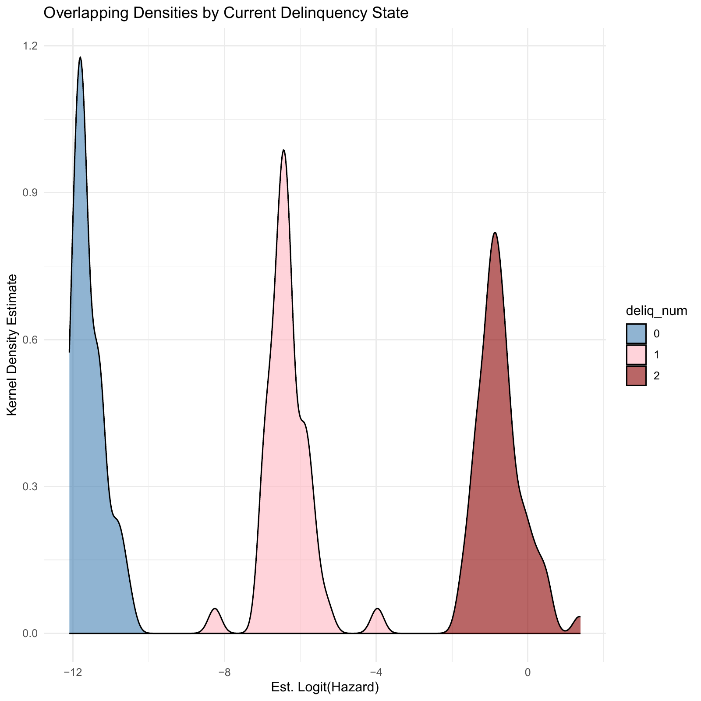
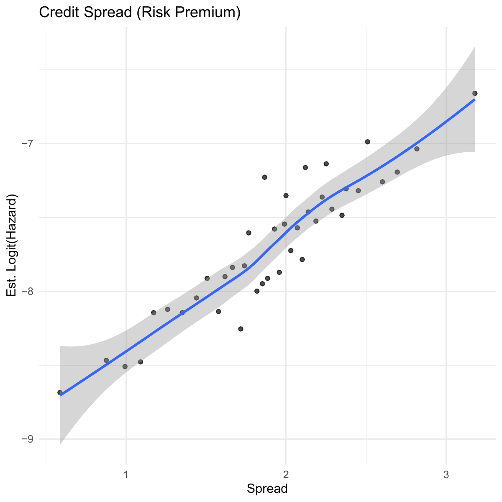
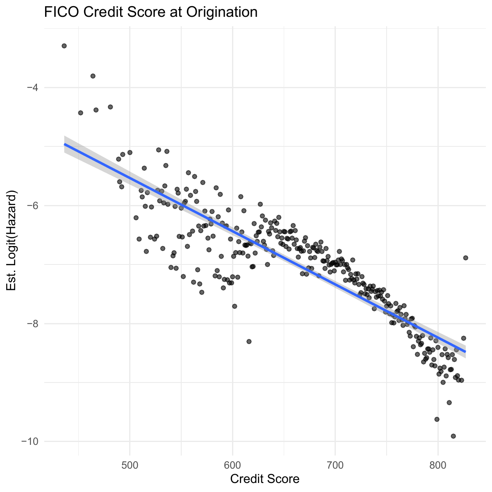
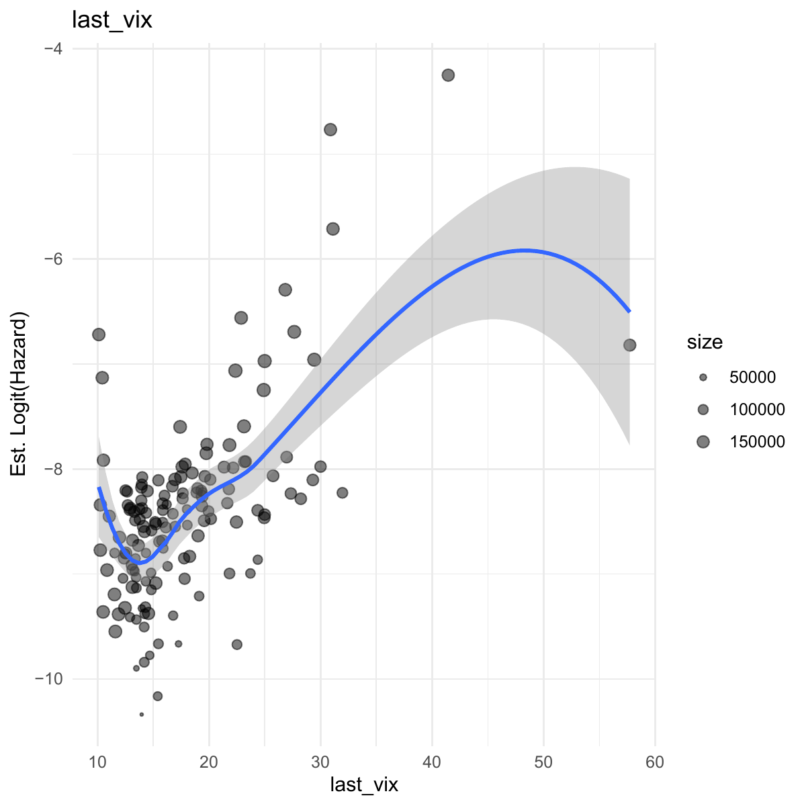
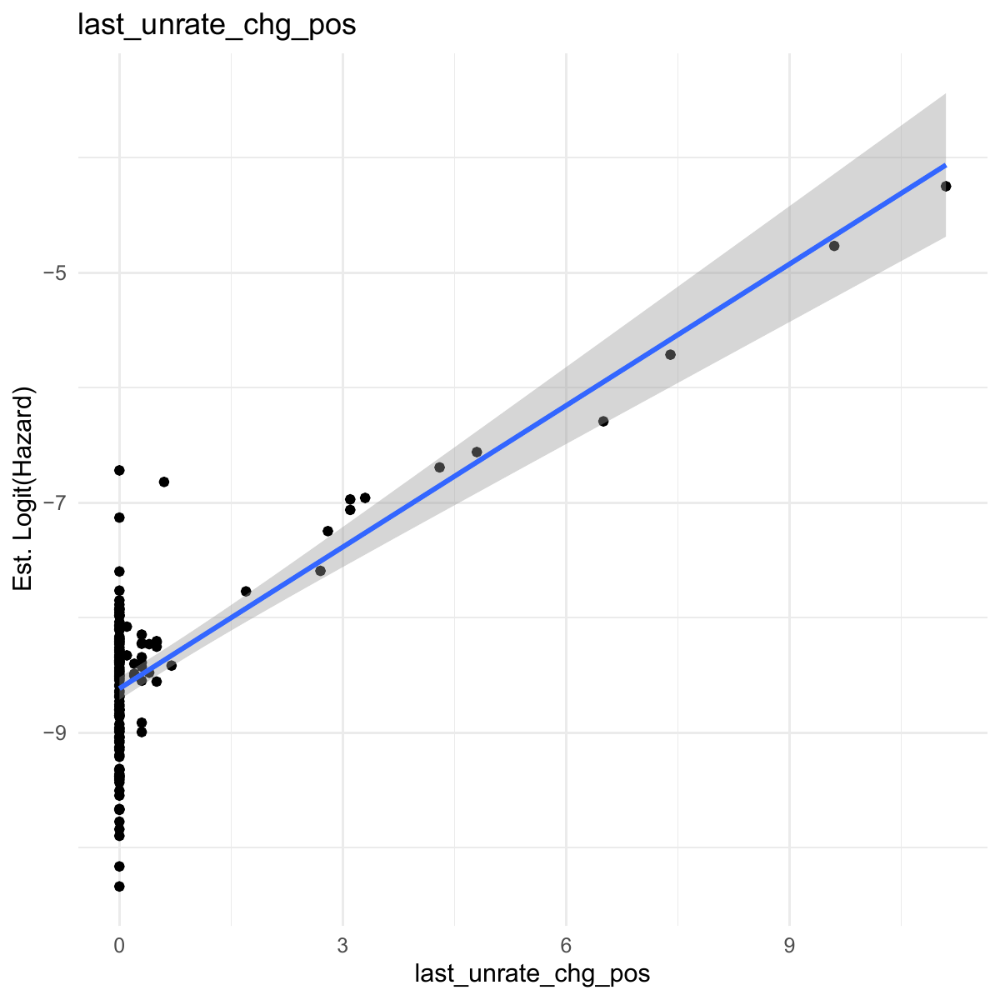
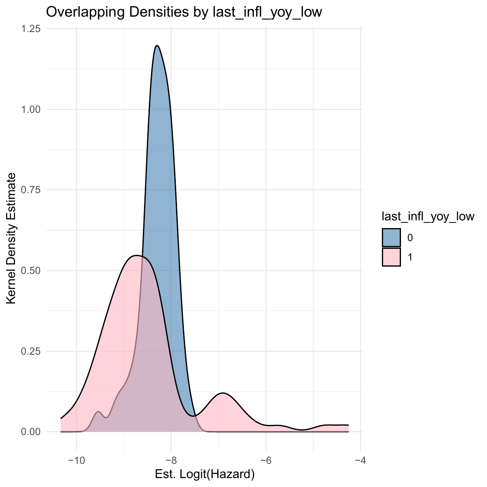
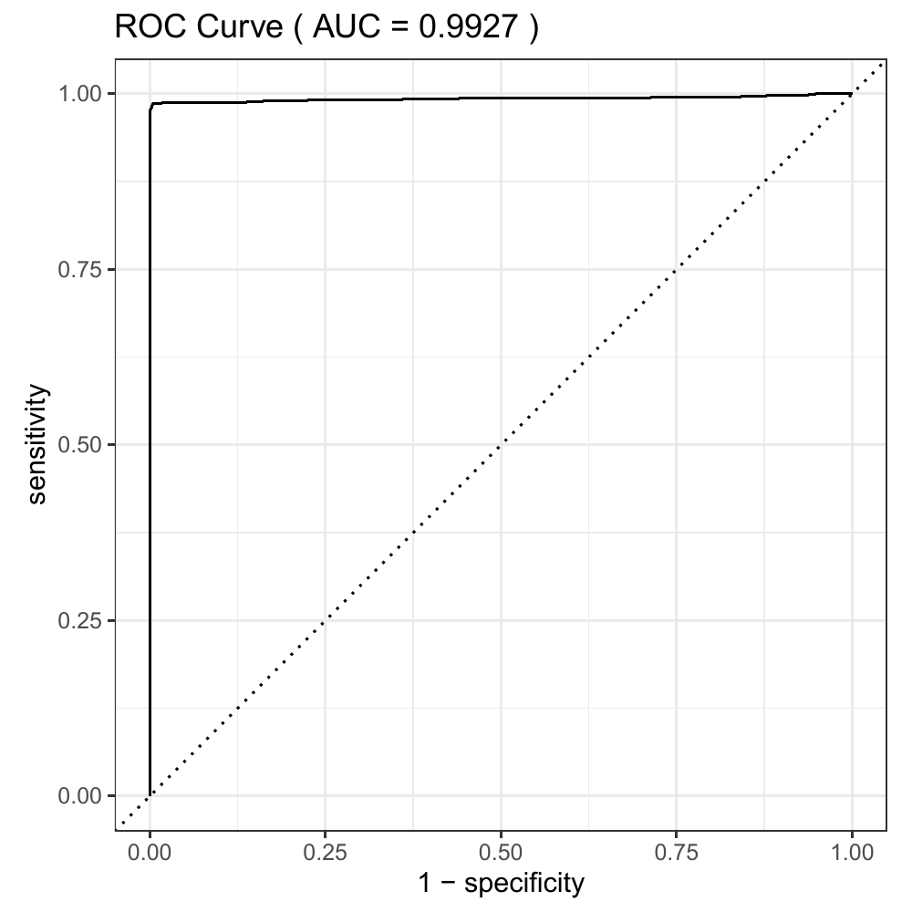
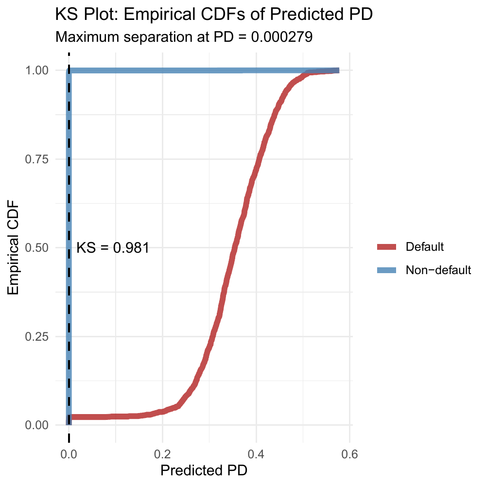
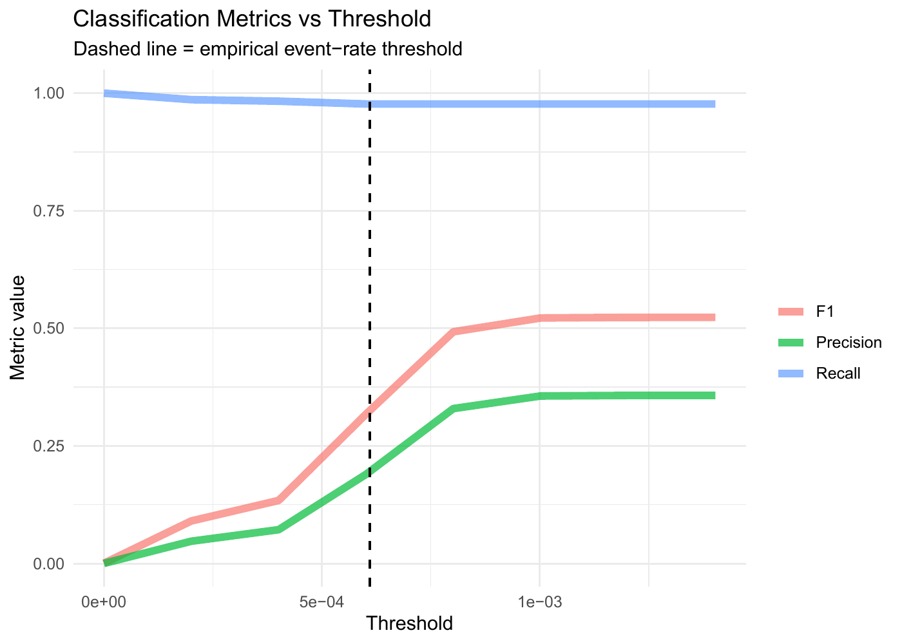
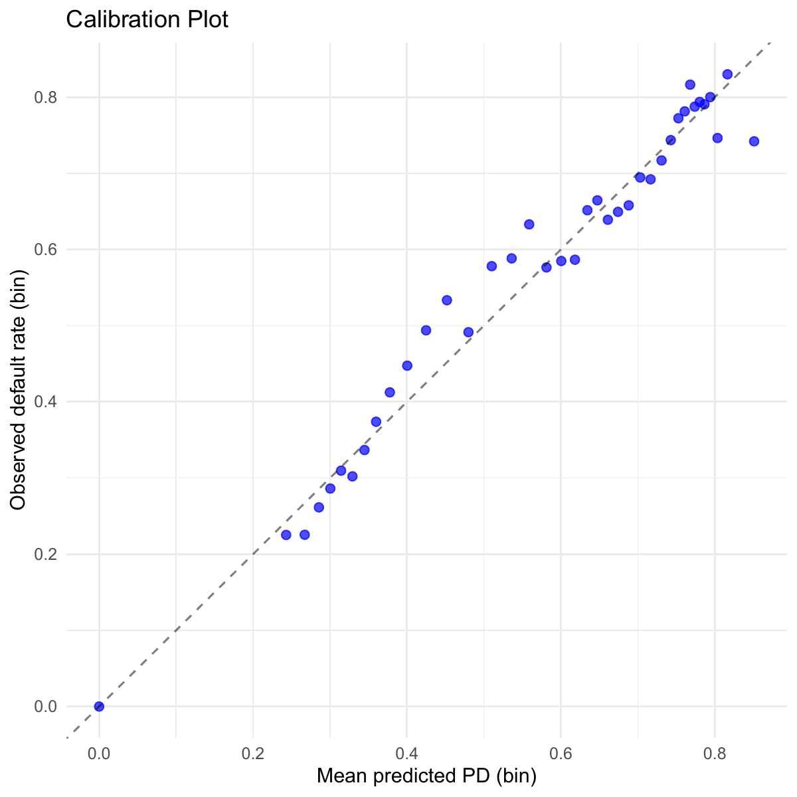

# Credit Risk Analysis: Retail Mortgage Loans
## **State-Dependent Logistic Hazard Model for 1-Month-Ahead Default Prediction**

*Antonio Melacini - December 2025*

## Overview
- This project builds an early-warning probability of default (PD) model that predicts whether a mortgage will default in the next month using information available in the current month. We define "default" as the event of a loan having 3+ missed payments.
- The model is trained on loan-month panel data that is comprised of loan origination characteristics, monthly loan performance, and monthly macroeconomic variables.
- The model is state-dependent in the sense that one of the predictors is the current delinquency state (number of missed payments).
- This is designed for applications in credit portfolio monitoring (e.g. flag loans with rising risk) and account management (e.g. offer deals to stable borrowers), not for modeling "ever-default" from origination.
- *Note:*
    - Additional summary points about the data and methodology are provided at the end of this README document.
    - **Full technical report (LaTeX PDF):** [Mortgage-Credit-Risk-Regression.pdf](Mortgage-Credit-Risk-Regression.pdf).

## Data
- **Freddie Mac Single-Family Loan-Level Dataset (SFLLD)**: vintages **2013, 2016, 2020**
- Train/test split (70/30):
  - **Train:** 2013/02 $-$ 2021/09  
  - **Test:** 2021/10 $-$ 2025/05  
- All loans are fixed-rate mortgages (FRMs) without prepayment penalties (non-PPM) in the sample.
- **Total size:** (before data cleaning and variable selection)
    - $\approx 18$ GB 
    - 300,000 loans (cohort of 100,000 loans for each vintage)

## Key Predictors
Some of the key predictors used in the model are summarized below. 

The scatterplots show the covariates on the x-axis plotted against the logit transform of the empirical hazard rate on the y-axis. For categorical predictors, they are visualized with grouped Kernel Density Estimates (KDEs) of the logit transform of the empirical hazard rate.

**Loan Performance (Loan- and Time-Dependent)**
- `deliq_num` (current number of missed payments): very strong positive association (a loan can only reach 3 missed payments once it missed 2 payments)
- `last_vtl_est` (estimated value-to-loan ratio, proxy for equity): weak positive association
    - Derived from the LTV ratio at origination and aggregate monthly growth in home prices measured with the Home Price Index (HPI).

    

**Borrower Risk at Origination (Loan-Dependent)**
- `cr_spread` (origination credit spread): strong positive association
    - Derived by deducting the yield on the 10-year Treasury at the time of origination from the interest rate on the loan at origination
- `credit_score` (FICO): strong negative association  
- `dti_missing` and `transf_dti` (DTI at origination): U-shaped (convex non-monotone) association

    
     

**Macroeconomic and Market-Based (Time-Dependent)**
- `last_vix` (lagged CBOE Volatility Index): moderate-to-strong positive association
- `last_unrate_chg_pos` (positive part of the YoY change in the unemployment rate): strong positive association  
- `last_infl_yoy_low` (indicator for inflation rate being at or below 2.5\%): shift in distribution of risk
<table align="center">
  <tr>
    <td align="center">
       
       VIX (Volatility Index)
    </td>
    <td align="center">
       
       Max(YoY Change in Unemployment Rate, 0)
    </td>
    <td align="center">
       
       Low YoY Inflation Indicator
    </td>
  </tr>
</table>

**Controls**
- Region, occupancy status, loan purpose, long-term loan indicator, and *baseline hazard control* using natural splines transformation of loan age with 2 degrees of freedom.

## Performance Evaluation

### Plots of Key Metrics on Test Set Predictions

 
     
    
    

### Results (Test Set)
- **AUC = 0.99** (very strong ranking performance)
- **KS = 0.98** (large separation between default and non-default)
- At *empirical event-rate threshold*:
  - **Recall (Sensitivity) = 0.98**
  - **Precision = 0.20**
  - **F1 = 0.30**
- Raising the threshold to around **0.001** (a little less than double the empirical event-rate) can improve the balance:
  - **F1 = 0.51** and a very small decrease in recall

### Calibration (Train Set)

  

## Repo Notes
- Report is written in R Markdown; heavy computations are done in separate code-only R scripts and saved as RDS objects and figures. 
- Key generated artifacts:
  - `objects/*.rds` (model outputs, tables)
  - `figures/*` (EDA + evaluation plots)

## Additional Notes on Data and Methodology
- Macroeconomic variables are lagged to prevent leakage since the data for month $t$ is published in month $t+1$.
- Due to the panel structure of the data, we use cluster-robust standard errors (clustered on loan IDs) to account for within-loan dependence over time.
- There is inherent censoring at data cutoff and enforced right-truncation by treating prepayment as censoring.

