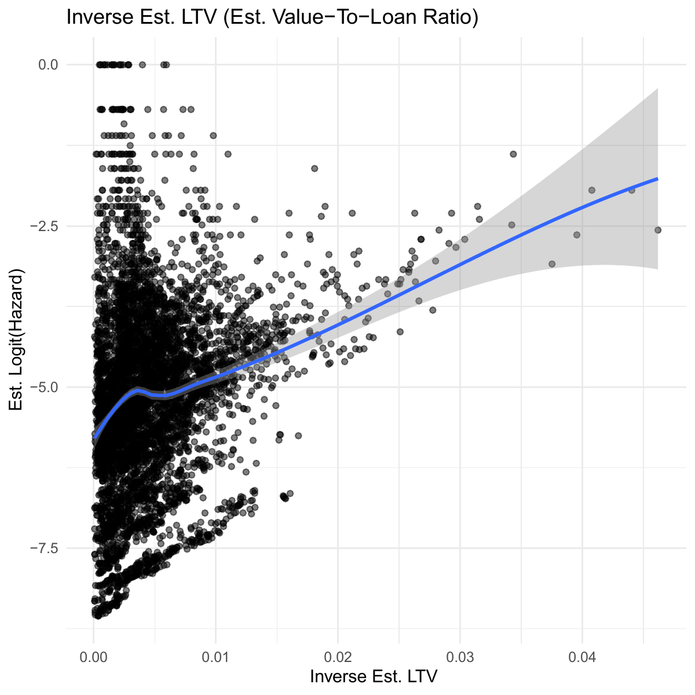

# Credit Risk Analysis: Retail Mortgage Loans
## **State-Dependent Logistic Hazard Model for 1-Month-Ahead Default Prediction**

*Antonio Melacini - December 2025*

## Overview
- This project builds an early-warning probability of default (PD) model that predicts whether a mortgage will become 90+ DPD (3+ missed payments) in the next month using information available in the current month. 
- The model is trained on loan-month panel data which is comprised of loan origination characteristics, monthly loan performance, and monthly macroeconomic variables.
    - Macroecnoomic variables are lagged to prevent leakage since the data for month $t$ is published in month $t+1$.
    - Due to the panel structure of the data, we use cluster-robust standard errors (clustered on loan IDs) to account for within-loan dependence over time.
- The model is state-dependent in the sense that one of the predictors is the current delinquency state (number of missed payments).
- In order to have a sufficient number of "events" in the data, we define default as the event of a loan having 3+ missed payments.
      - Also note that we have censoring at data cutoff and prepayment is treated as censoring.
- This is designed for applications to credit portfolio monitoring (flagging loans with rising risk), not "ever-default" origination pricing.
- *Note:* The comprehensive model definition (with math) is typeset with LaTeX in the report "Mortgage-Credit-Risk-Regression.pdf".

## Data
- **Freddie Mac Single-Family Loan-Level Dataset (SFLLD)**: vintages **2013, 2016, 2020**
- Train/test split:
  - **Train:** 2013/02 $-$ 2021/09  
  - **Test:** 2021/10 $-$ 2025/05  
- All loans are fixed-rate mortgages (FRMs) without prepayment penalties (non-PPM) in the sample.
- **Total size:** ~ 18 GB
- Missing DTI handled with:
  - `dti_missing` indicator
  - median-imputed DTI used inside `transf_dti = |DTI − 15|`

## Key Predictors (Greatest Signal)

**Behavioural (Loan- and Time-Dependent)**
- `deliq_num` (missed-payments state): dominates short-horizon PD

**Collateral (Loan- and Time-Dependent)**
- `last_vtl_est` (estimated value-to-loan ratio, proxy for equity): weak-to-moderate positive association
    - Derived from the LTV ratio at origination and aggregate monthly growth in home prices measured with the Home Price Index (HPI).

    

**Borrower Risk at Origination (Loan-Dependent)**
- `cr_spread` (origination credit spread): strong positive association
    - Derived by deducting the yield on the 10-year Treasury at the time of origination from the interest rate on the loan at origination
- `credit_score` (FICO): strong negative association  
- `dti_missing` and `transf_dti`$=|\text{DTI}-15|$: capture underwriting/affordability effects

    
     

**Macroeconomic and Market-Based (Time-Dependent)**
- `last_vix` (lagged CBOE Volatility Index): moderate-to-strong positive association
- `last_unrate_chg_pos`$=\max(\Delta_{12}\text{UR},0)$ (positive part of the YoY change in the unemployment rate): strong positive association  
- `last_infl_yoy_low` (indicaator for inflation rate being at or below 2.5\%): shift in distribution of risk

    
    
     

**Controls**
- region, occupancy status, loan purpose, long-term loan indicator, and *baseline hazard control* using natural splines transformation of loan age with 2 degrees of freedom.

## Performance Evaluation

### ROC Curve (Test Set)

  

### KS Plot (Test Set)

  

### Calibration (Train Set)

  

## Results (Test Set)
- **AUC = 0.99** (very strong ranking performance)
- **KS = 0.98** (large separation between default and non-default)

## Thresholding Tradeoff:

  

- At *empirical event-rate threshold*:
  - **Recall (Sensitivity) = 0.98**
  - **Precision = 0.20**
  - **F1 = 0.30**
- Raising the threshold to around **0.001** (a little less than double the emprirical event-rate) can improve the balance:
  - **F1 = 0.51** and a very small decrease in recall

## Repo Notes
- Report is written in R Markdown; heavy computations are done in separate code-only R scripts and saved as RDS objects and figures. 
- Key generated artifacts:
  - `objects/*.rds` (model outputs, tables)
  - `figures/*` (EDA + evaluation plots)

